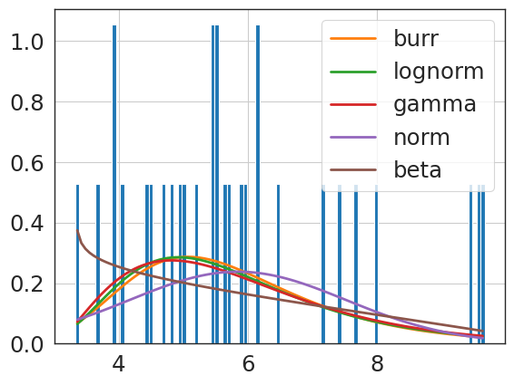
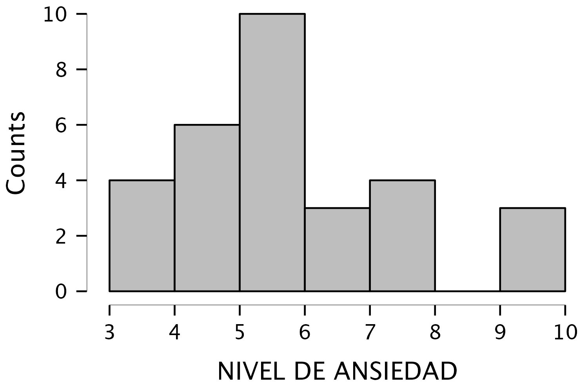
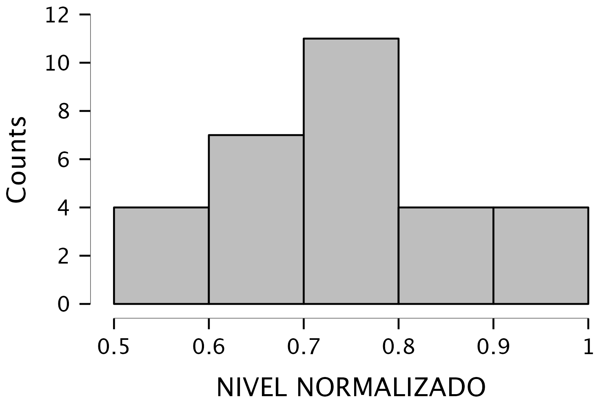
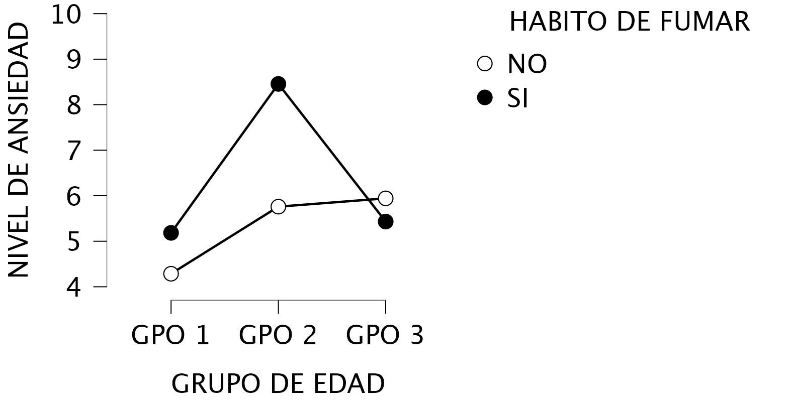

<!-- _footer: . -->

## Análisis de varianza con dos factores: Caso I
Taller de Consultoría
Ismael Sandoval Aguilar

---

## Caso I

Analizar el nivel de ansiedad por grupo de edad y hábitos de fumar.

<br>

<center>

<style scoped>
table {
    font-size: 13px;
}
</style>

|      |       | HÁBITOS DE FUMAR |      |      |      |      |      |      |      |      |      |
|------|-------|------------------|------|------|------|------|------|------|------|------|------|
|      |       | NO               |      |      |      |      | SÍ   |      |      |      |      |
| EDAD | GPO 1 | 3.91             | 5.01 | 4.47 | 3.33 | 4.71 | 4.83 | 3.95 | 4.04 | 3.66 | 9.44 |
|      | GPO 2 | 5.65             | 6.49 | 5.5  | 5.72 | 5.44 | 9.66 | 7.68 | 9.57 | 7.98 | 7.39 |
|      | GPO 3 | 4.94             | 7.13 | 5.54 | 5.94 | 6.16 | 5.92 | 5.48 | 5.19 | 6.12 | 4.45 |

<br>


---

## Objetivo

Determinar si existen diferencias significativas en el nivel medio de ansiedad dado el grupo de edad y/o el hábito.

---
## Elementos del Análisis de Varianza

1. Unidad de Análisis: El individuo al que se les realizó la medición de su nivel de ansiedad. 
2. Factores: Grupos de edad y hábitos de fumar.
3. Variable Dependiente: Nivel de ansiedad.

---

## ANOVA
<br>

<center>

<style scoped>
table {
    font-size: 19px;
}
</style>


| Cases                           | Sum of Squares | df   | Mean Square | F       | p        | $\eta$$^{2}$ | $\eta$$^{2}$ₚ |
|---------------------------------|----------------|------|-------------|---------|----------|--------------|---------------|
| HABITO DE FUMAR                 | $7.926$        | $1$  | $7.926$     | $5.447$ | $0.028$  | $0.094$      | $0.185$       |
| GRUPO DE EDAD                   | $28.522$       | $2$  | $14.261$    | $9.802$ | $<$ .001 | $0.338$      | $0.450$       |
| HABITO DE FUMAR * GRUPO DE EDAD | $12.911$       | $2$  | $6.456$     | $4.437$ | $0.023$  | $0.153$      | $0.270$       |
| Residuals                       | $34.920$       | $24$ | $1.455$     | $$      | $ $      | $$           | $$            |


<br>

---

## Supuesto de Homogeneidad de Varianza 

<center>

<br> 

| F       | df1     | df2      | p       |
|---------|---------|----------|---------|
| $2.709$ | $5.000$ | $24.000$ | $0.045$ |

<br> 

Observación: $p < 0.05$ ($H_0$ rechazada)

---

## Transformación de datos

Criterios para aplicar una transformación logarítmica base diez (Feng et al., 2014):

- Los datos presentan un sesgo.
- Los datos se aproximan a una distribución log-normal.
- Todos los datos deben ser positivos.
---

## Distribución de los datos

```python
variable_dependiente = dataset["NIVEL DE ANSIEDAD"].values 
f = Fitter(variable_dependiente,
           distributions=['gamma',
                          'lognorm',
                          "beta",
                          "burr",
                          "norm"])
f.fit()
f.summary()
```

---

## Distribución de los datos

<br>
<center>

<style scoped>
table {
    font-size: 20px;
}
</style>

| index   | sumsquare_error   | ks_statistic        | ks_pvalue          |
|---------|-------------------|---------------------|--------------------|
| burr    | 7.476965316190111 | 0.07944662973179661 | 0.9836429988638326 |
| lognorm | 7.491362169243271 | 0.08142750195426995 | 0.9791357595447757 |
| gamma   | 7.509370515300779 | 0.08687389989207384 | 0.9625996307363383 |
| norm    | 7.750085357373607 | 0.15840679938133273 | 0.3973545887753237 |
| beta    | 7.828791306270364 | 0.13945757656185306 | 0.5569569091880072 |


---

## Distribución de los datos

<br>
<center>



---

## Estadística Descriptiva (datos originales)

<br>
<center>

<style scoped>
table {
    font-size: 18px;
}
</style>

|                         | NIVEL DE ANSIEDAD |
|-------------------------|-------------------|
| Valid                   | $30$              |
| Missing                 | $0$               |
| Mean                    | $5.843$           |
| Std. Deviation          | $1.705$           |
| Skewness                | $0.897$           |
| Std. Error of Skewness  | $0.427$           |
| Shapiro-Wilk            | $0.919$           |
| P-value of Shapiro-Wilk | $0.025$           |
| Minimum                 | $3.330$           |
| Maximum                 | $9.660$           |

---

## Gráfica de distribución (datos originales)

<br>

<center>


---

## Estadística Descriptiva (datos normalizados)

<br>
<center>

<style scoped>
table {
    font-size: 18px;
}
</style>

|                         | NIVEL NORMALIZADO |
|-------------------------|-------------------|
| Valid                   | $30$              |
| Missing                 | $0$               |
| Mean                    | $0.750$           |
| Std. Deviation          | $0.121$           |
| Skewness                | $0.290$           |
| Std. Error of Skewness  | $0.427$           |
| Shapiro-Wilk            | $0.971$           |
| P-value of Shapiro-Wilk | $0.558$           |
| Minimum                 | $0.522$           |
| Maximum                 | $0.985$           |

---

## Gráfica de distribución (datos normalizados)

<br>

<center>


---

## Supuesto de Homogeneidad de Varianza (datos normalizados)

<br>
<center>

| F       | df1     | df2      | p       |
|---------|---------|----------|---------|
| $2.076$ | $5.000$ | $24.000$ | $0.104$ |

<br>

Observación: $p > 0.05$ ($H_0$ aceptada)

---

## Gráfica descriptiva

<br>

<center>


---

## Comparaciones post-hoc

Hábito de fumar (datos originales):

<br>
<center>

|  |  | Mean Difference | SE      | t        | p$_{tukey}$ |
|-----|-----|-----------------|---------|----------|-------------|
| NO  | SÍ  | $-1.028$        | $0.440$ | $-2.334$ | $0.028$ *     |

<br>

Observación: $p < 0.05$

---

## Comparaciones post-hoc 

Grupo de edad (datos originales):

<br>
<center>

<style scoped>
table {
    font-size: 21px;
}
</style>

|    |    | Mean Difference | SE      | t        | p$_{tukey}$ |
|-------|-------|-----------------|---------|----------|-------------|
| GPO 1 | GPO 2 | $-2.373$        | $0.539$ | $-4.399$ | $<$ .001 *   |
|    | GPO 3 | $-0.952$        | $0.539$ | $-1.765$ | $0.203$     |
| GPO 2 | GPO 3 | $1.421$         | $0.539$ | $2.634$  | $0.037$ *     |

<br>

Observación: $p < 0.05$

---


<center>

<style scoped>
table {
    font-size: 15px;
}
</style>

|          |          | Mean Difference | SE      | t        | p$_{tukey}$ |
|----------|----------|-----------------|---------|----------|-------------|
| NO GPO 1 | SI GPO 1 | $-0.898$        | $0.763$ | $-1.177$ | $0.843$     |
|          | NO GPO 2 | $-1.474$        | $0.763$ | $-1.932$ | $0.408$     |
|          | SI GPO 2 | $-4.170$        | $0.763$ | $-5.466$ | $<$ .001 *  |
|          | NO GPO 3 | $-1.656$        | $0.763$ | $-2.171$ | $0.287$     |
|          | SI GPO 3 | $-1.146$        | $0.763$ | $-1.502$ | $0.666$     |
| SI GPO 1 | NO GPO 2 | $-0.576$        | $0.763$ | $-0.755$ | $0.972$     |
|          | SI GPO 2 | $-3.272$        | $0.763$ | $-4.289$ | $0.003$ *   |
|          | NO GPO 3 | $-0.758$        | $0.763$ | $-0.994$ | $0.916$     |
|          | SI GPO 3 | $-0.248$        | $0.763$ | $-0.325$ | $0.999$     |
| NO GPO 2 | SI GPO 2 | $-2.696$        | $0.763$ | $-3.534$ | $0.019$     |
|          | NO GPO 3 | $-0.182$        | $0.763$ | $-0.239$ | $1.000$     |
|          | SI GPO 3 | $0.328$         | $0.763$ | $0.430$  | $0.998$     |
| SI GPO 2 | NO GPO 3 | $2.514$         | $0.763$ | $3.295$  | $0.032$ *   |
|          | SI GPO 3 | $3.024$         | $0.763$ | $3.964$  | $0.007$ *   |
| NO GPO 3 | SI GPO 3 | $0.510$         | $0.763$ | $0.669$  | $0.984$     |


---

# Bibliografía

- Feng, C., Wang, H., Lu, N., Tian, C., He, H., Lu, Y., & Tu, X. (2014). Log-transformation and its implications for data analysis. PubMed. https://doi.org/10.3969/j.issn.1002-0829.2014.02.009