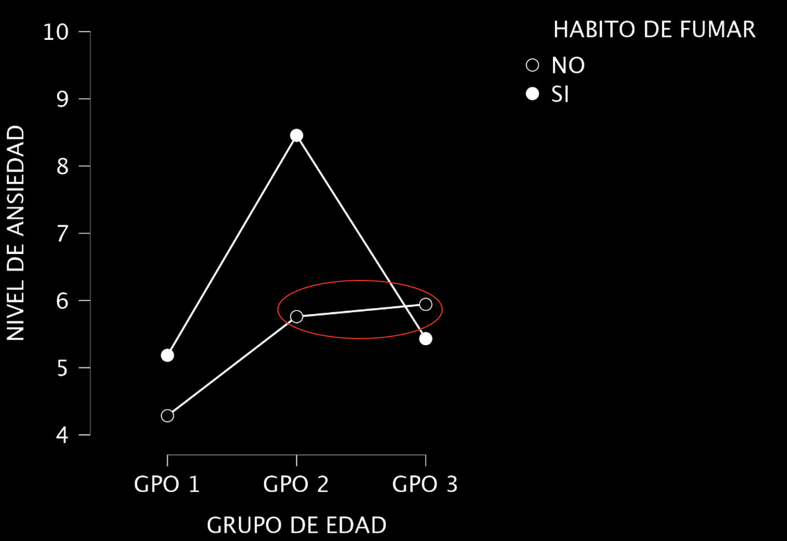

<!-- _footer: . -->

## Análisis de varianza con dos factores: Caso I
Taller de Consultoría
Ismael Sandoval Aguilar

---

## Caso I

Se requiere analizar el nivel de ansiedad por grupo de edad y hábitos de fumar.

 

 

---

## Objetivo

Determinar si existen diferencias significativas en el nivel medio de ansiedad dado el grupo de edad y/o los hábitos de fumar.

---

## Tipo de ANOVA implementado

Se aplicó un ANOVA de elementos fijos, de dos factores:

- Grupo de edad: tres niveles.
- Hábitos de fumar: dos niveles.

---

## Elementos del ANOVA de dos factores

1. Unidad de Análisis: El individuo al que se les realizó la medición de su nivel de ansiedad. 
2. Factores: 
   - Grupo de edad (tres niveles): Grupos 1, 2 o 3.
   - Hábitos de fumar (dos niveles): Sí o no.
3. Variable Dependiente: Nivel de ansiedad.

--- 

## Supuestos del ANOVA de dos factores

Además de la homocedasticidad y normalidad, se busca evaluar las siguientes hipótesis:

- $H_0$: El promedio del nivel de ansiedad es el mismo entre cada hábito de fumar.
- $H_0$: El promedio del nivel de ansiedad es el mismo entre cada grupo (grupo 1, 2 y 3).
- $H_0$: La intersección entre ambos factores (grupo de edad y hábitos de fumar) no es significativa en el nivel medio de ansiedad.

---

## Supuestos del ANOVA de dos factores

Versus:

- $H_1$: Al menos uno de los promedios del nivel de ansiedad entre cada hábito de fumar es diferente. 
- $H_1$: Al menos uno de los promedios del nivel de ansiedad entre cada grupo es diferente. 
- $H_1$: La intersección entre ambos factores (grupo de edad y hábitos de fumar) es significativa en el nivel medio de ansiedad.

---

## Verificación de los supuestos

Supuesto de normalidad (hábitos): Existe evidencia suficiente para decir que se cumple dicho supuesto para los hábitos de fumar.

 

*Nivel de ansiedad*

|                         | NO      | SÍ      |
|-------------------------|---------|---------|
| Shapiro-Wilk            | $0.984$ | $0.909$ |
| P-value of Shapiro-Wilk | $0.990$ | $0.130$ |

---

## Verificación de los supuestos

Supuesto de normalidad (grupos): Existe evidencia suficiente para decir que se cumple dicho supuesto para los grupos de edad 2 y 3.

 

*Nivel de ansiedad*

|                         | GPO 1    | GPO 2   | GPO 3   |
|-------------------------|----------|---------|---------|
| Shapiro-Wilk            | $0.666$  | $0.874$ | $0.975$ |
| P-value of Shapiro-Wilk | $<$ .001 | $0.111$ | $0.930$ |

---

## Verificación de los supuestos

Supuesto de homogeneidad: el p-valor se aproxima lo suficente existe para decir que se cumple dicho supuesto.

 

*Prueba de Levene*

| F       | df1     | df2      | p       |
|---------|---------|----------|---------|
| $2.709$ | $5.000$ | $24.000$ | $0.045$ |

---

## ANOVA de dos factores

Existe evidencia suficiente para decir que hay diferencias significativas en el nivel medio de ansiedad:

 - Entre los diferentes grupos.
 - Entre los hábitos de fumar.
 - Entre la intersección de ambos factores.

 

| Cases                           | Sum of Squares | df   | Mean Square | F       | p        | $\eta$$^{2}$ₚ |
|---------------------------------|----------------|------|-------------|---------|----------|---------------|
| HABITO DE FUMAR                 | $7.926$        | $1$  | $7.926$     | $5.447$ | $0.028$  | $0.185$       |
| GRUPO DE EDAD                   | $28.522$       | $2$  | $14.261$    | $9.802$ | $<$ .001 | $0.450$       |
| HABITO DE FUMAR * GRUPO DE EDAD | $12.911$       | $2$  | $6.456$     | $4.437$ | $0.023$  | $0.270$       |
| Residuals                       | $34.920$       | $24$ | $1.455$     |       |       |             |

---

## ANOVA de dos factores

- El 18.5% de la variación del nivel medio de ansiedad es explicada por los hábitos de fumar.
- El 45% de la variación del nivel medio de ansiedad es explicada por los grupos de edad (máximo).
- El 27% de la variación del nivel medio de ansiedad es explicada por la intersección entre ambos factores.

 

| Cases                           | Sum of Squares | df   | Mean Square | F       | p        | $\eta$$^{2}$ₚ |
|---------------------------------|----------------|------|-------------|---------|----------|---------------|
| HABITO DE FUMAR                 | $7.926$        | $1$  | $7.926$     | $5.447$ | $0.028$  | $0.185$       |
| GRUPO DE EDAD                   | $28.522$       | $2$  | $14.261$    | $9.802$ | $<$ .001 | $0.450$       |
| HABITO DE FUMAR * GRUPO DE EDAD | $12.911$       | $2$  | $6.456$     | $4.437$ | $0.023$  | $0.270$       |
| Residuals                       | $34.920$       | $24$ | $1.455$     |       |       |             |

---

## Prueba post-hoc

Existen diferencias significativas en el nivel medio de ansiedad entre los hábitos de fumar. La media mayor corresponde al hábito de fumar "Sí" (6.35).

 

*Hábito de fumar*

|    |    | Mean Difference | SE      | t        | p$_{tukey}$ |
|----|----|-----------------|---------|----------|-------------|
| NO | SI | $-1.028$        | $0.440$ | $-2.334$ | $0.028$     |

---

## Prueba post-hoc

Existen diferencias significativas en el nivel medio de ansiedad entre:

- Grupo 1 y grupo 2, la media mayor corresponde al grupo 2 (7.108).
- Grupo 2 y grupo 3, la media mayor corresponde al grupo 2.

 

*Grupos de edad*

|       |    | Mean Difference | SE      | t        | p$_{tukey}$ |
|-------|-------|-----------------|---------|----------|-------------|
| GPO 1 | GPO 2 | $-2.373$        | $0.539$ | $-4.399$ | $<$ .001    |
|       | GPO 3 | $-0.952$        | $0.539$ | $-1.765$ | $0.203$     |
| GPO 2 | GPO 3 | $1.421$         | $0.539$ | $2.634$  | $0.037$     |

---

## Prueba post-hoc

Existen diferencias significativas en el nivel medio de ansiedad entre los siguientes pares:

- Los no fumadores del grupo 1 y los fumadores del grupo 2.
- Los fumadores del grupo 1 y los fumadores del grupo 2.
- Los no fumadores del grupo 2 y los fumadores del grupo 2.
- Los fumadores del grupo 2 y los no fumadores del grupo 3.
- Los fumadores del grupo 2 y los fumadores del grupo 3.

---

## Prueba post-hoc

 

*Hábito de fumar * Grupos de edad*

|          |          | Mean Difference | SE      | t        | p$_{tukey}$ |
|----------|----------|-----------------|---------|----------|-------------|
| NO GPO 1 | SI GPO 2 | $-4.170$        | $0.763$ | $-5.466$ | $<$ .001    |
| SI GPO 1 | SI GPO 2 | $-3.272$        | $0.763$ | $-4.289$ | $0.003$     |
| NO GPO 2 | SI GPO 2 | $-2.696$        | $0.763$ | $-3.534$ | $0.019$     |
| SI GPO 2 | NO GPO 3 | $2.514$         | $0.763$ | $3.295$  | $0.032$     |
|          | SI GPO 3 | $3.024$         | $0.763$ | $3.964$  | $0.007$     |
---

## Diferencia entre las medias 

- La media del nivel de ansiedad de los no fumadores del grupo 1 es menor a la de los fumadores del grupo 2.
- La media del nivel de ansiedad de los fumadores del grupo 1 es menor a la de los fumadores del grupo 2.
- La media del nivel de ansiedad de los no fumadores del grupo 2 es menor a la de los fumadores del grupo 2.
- La media del nivel de ansiedad de los fumadores del grupo 2 es mayor a la de los no fumadores del grupo 3.
- La media del nivel de ansiedad de los fumadores del grupo 2 es mayor a la de los fumadores del grupo 3.

---

## Gráfica descriptiva 

 

---

## Conclusiones 

- Los factores que tienen mayor explicación en la variación del nivel medio de ansiedad son: el grupo de edad (45%) y la intersección entre dicho factor y los hábitos de fumar (27%).
- Generalmente los no fumadores tienen menos niveles de ansiedad.
- No existen diferencias significativas entre las medias del nivel de ansiedad de los no fumadores del grupo 2 y 3.